# npm Registry Configuration & Publishing Guide

## 🔒 CRITICAL: Token Security

> ⚠️ **WARNING**: Never commit npm tokens to git, never share them publicly, and never paste them in chat/email.

### If Your Token Was Exposed:

1. **IMMEDIATELY revoke the old token**:
   - Go to https://www.npmjs.com/settings/tokens
   - Find and delete the exposed token
   - Regenerate a new token

2. **Update GitHub Secret**:
   - Go to https://github.com/sidinsearch/BugProof/settings/secrets/actions
   - Update `NPM_TOKEN` with the new token
   - Old token becomes useless

3. **Never commit tokens**:
   - Keep tokens in GitHub Secrets only
   - Use environment variables at runtime
   - `.npmrc` should never be committed if it contains tokens

---

## 📦 npmjs.com vs GitHub Packages

### npmjs.com (Public Registry)

| Property | Details |
|----------|---------|
| **URL** | https://registry.npmjs.org |
| **Scope** | Public (unscoped packages) |
| **Package Name** | `bugproof` |
| **Authentication** | NPM_TOKEN (from npmjs.com) |
| **Access** | `npm install -g bugproof` |
| **Best For** | General public distribution |
| **Discoverability** | Listed on npmjs.com (searchable) |
| **Downloads** | Public stats available |

### GitHub Packages (GitHub-Hosted Registry)

| Property | Details |
|----------|---------|
| **URL** | https://npm.pkg.github.com |
| **Scope** | Scoped packages only (@org/name) |
| **Package Name** | `@sidinsearch/bugproof` |
| **Authentication** | GITHUB_TOKEN (auto-provided) |
| **Access** | Requires registry URL in .npmrc |
| **Best For** | GitHub organization packages |
| **Discoverability** | Linked to GitHub repo |
| **Downloads** | Visible in GitHub Packages page |

---

## Key Differences Explained

### 1. **Registry URLs**

npmjs.com uses the default registry:
```bash
npm config set registry https://registry.npmjs.org
npm install bugproof  # Searches npmjs automatically
```

GitHub Packages requires explicit registry in `.npmrc`:
```bash
npm config set @sidinsearch:registry=https://npm.pkg.github.com
npm install @sidinsearch/bugproof  # Must specify registry or use scoped config
```

### 2. **Package Naming**

npmjs.com: **Unscoped** package name
```json
{
  "name": "bugproof"
}
```
- Install: `npm install bugproof`
- Search: Visible on https://www.npmjs.com/search

GitHub Packages: **Scoped** package name required
```json
{
  "name": "@sidinsearch/bugproof"
}
```
- Install: `npm install @sidinsearch/bugproof`
- Must match GitHub org/user

### 3. **Authentication**

**npmjs.com** uses personal NPM_TOKEN:
```bash
npm login
# OR
echo "//registry.npmjs.org/:_authToken=YOUR_NPM_TOKEN" >> ~/.npmrc
npm publish
```

**GitHub Packages** uses GITHUB_TOKEN (automatic in Actions):
```bash
# In GitHub Actions, GITHUB_TOKEN is auto-provided
npm publish --registry https://npm.pkg.github.com
```

### 4. **Dual Publishing Strategy for BugProof**

Our setup publishes to BOTH registries:

| Registry | Package Name | How to Install |
|----------|--------------|---|
| npmjs.com | `bugproof` | `npm install -g bugproof` |
| GitHub Packages | `@sidinsearch/bugproof` | `npm install -g @sidinsearch/bugproof --registry https://npm.pkg.github.com` |

This requires:
- **Same code**, different package names
- **Different .npmrc configurations** during publish
- **Separate publish commands** for each registry

---

## GitHub Actions Workflow (Automated)

### How Our Pipeline Works

When you push a git tag (e.g., `v0.1.0`):

```mermaid
graph LR
    A["git tag v0.1.0"] -->|push| B["GitHub Actions"]
    B -->|1. npm ci| C["Install deps"]
    C -->|2. npm test| D["Run tests"]
    D -->|3. npm lint| E["Run linter"]
    E -->|4. npm build| F["Build TypeScript"]
    F -->|5. npm publish| G["Publish to npmjs"]
    G -->|6. npm publish| H["Publish to GitHub Packages"]
    H -->|7. Create Release| I["GitHub Release"]
```



### Step-by-Step Pipeline

**1. Test & Build**
```bash
npm ci              # Clean install
npm test            # Verify all tests pass
npm lint            # Check code quality
npm build           # Compile TypeScript
```

**2. Publish to npmjs.com**
```bash
npm config set registry https://registry.npmjs.org/
npm publish         # Publishes 'bugproof' package
```
- Uses `NPM_TOKEN` secret
- Publishes to: https://www.npmjs.com/package/bugproof

**3. Publish to GitHub Packages**
```bash
npm config set @sidinsearch:registry=https://npm.pkg.github.com/
npm publish         # Publishes '@sidinsearch/bugproof' package
```
- Uses `GITHUB_TOKEN` (auto-provided)
- Publishes to: https://github.com/sidinsearch/BugProof/packages

**4. Create Release**
- Creates GitHub Release with download links
- Links to CHANGELOG.md

---

## Manual Publishing (Optional)

### Publish to npmjs.com Manually

```bash
# 1. Login to npm
npm login
# Enter email, password, OTP (if 2FA enabled)

# 2. Publish
npm publish

# 3. Verify
npm view bugproof
```

### Publish to GitHub Packages Manually

```bash
# 1. Configure registry for GitHub
npm config set @sidinsearch:registry=https://npm.pkg.github.com/

# 2. Add GitHub token to .npmrc
echo "//npm.pkg.github.com/:_authToken=YOUR_GITHUB_TOKEN" >> ~/.npmrc

# 3. Publish
npm publish

# 4. Verify
npm view @sidinsearch/bugproof --registry https://npm.pkg.github.com
```

---

## Setting Up Secrets in GitHub

### NPM_TOKEN (for npmjs.com)

1. Generate on npmjs.com:
   - https://www.npmjs.com/settings/tokens
   - Click "Generate new token"
   - Select "Automation" type (no expiration)
   - Copy the token

2. Add to GitHub:
   - Repo Settings → Secrets and variables → Actions
   - New repository secret
   - Name: `NPM_TOKEN`
   - Value: (paste the token)

### GITHUB_TOKEN (Automatic)

- ✅ Already provided by GitHub Actions
- ✅ No setup needed
- ✅ Auto-revoked after each workflow run

---

## Configuration Files

### .npmrc (Local - Don't commit)

```ini
registry=https://registry.npmjs.org/
//registry.npmjs.org/:_authToken=YOUR_NPM_TOKEN

@sidinsearch:registry=https://npm.pkg.github.com/
//npm.pkg.github.com/:_authToken=YOUR_GITHUB_TOKEN
```

**NEVER commit this file if it contains tokens!**

### .npmignore (Committed - Excludes from package)

```
# Already configured to exclude:
- node_modules/
- coverage/
- tests/
- src/
- docs/
- .github/
- build scripts
```

### package.json (Committed - Includes in package)

```json
{
  "name": "bugproof",
  "version": "0.1.0",
  "files": [
    "dist/",
    "assets/",
    "scripts/postinstall.cjs",
    "README.md",
    "LICENSE",
    "CHANGELOG.md"
  ]
}
```

---

## Understanding the Difference in Real-World Usage

### User Installing from npmjs.com

```bash
npm install -g bugproof
# Downloads from: https://www.npmjs.com/package/bugproof
# Installs unscoped package
# No registry URL needed
```

### User Installing from GitHub Packages

```bash
npm install -g @sidinsearch/bugproof --registry https://npm.pkg.github.com
# Downloads from: https://npm.pkg.github.com/@sidinsearch/bugproof
# Installs scoped package
# Requires explicit registry URL
```

### User Installing with Custom .npmrc

```bash
# In project/.npmrc or ~/.npmrc
@sidinsearch:registry=https://npm.pkg.github.com/
//npm.pkg.github.com/:_authToken=YOUR_GITHUB_TOKEN

npm install @sidinsearch/bugproof
# Now registry is looked up from .npmrc automatically
```

---

## Troubleshooting

| Problem | Solution |
|---------|----------|
| **"403 Forbidden" on npm publish** | NPM_TOKEN invalid/expired → Generate new token at npmjs.com |
| **"npm ERR! need auth" for GitHub Packages** | GITHUB_TOKEN not set or expired → Check GitHub Actions permissions |
| **Package not appearing on npmjs** | Wait 5-10 minutes, then check https://www.npmjs.com/package/bugproof |
| **Package not appearing on GitHub Packages** | Check repo, may need public visibility or org settings |
| **Can't install from GitHub Packages** | Forgot registry URL or GitHub token not in .npmrc |
| **Scoped vs unscoped confusion** | npmjs = unscoped (bugproof), GitHub = scoped (@sidinsearch/bugproof) |
| **Token leaked/exposed** | Regenerate immediately at https://www.npmjs.com/settings/tokens |

---

## Release Workflow (Recommended)

```bash
# 1. Verify everything is clean
git status

# 2. Update version in package.json
npm version patch  # or minor/major

# 3. Update CHANGELOG.md
# Add new version section with release notes

# 4. Run full test suite
npm test
npm lint

# 5. Commit version bump
git add package.json CHANGELOG.md
git commit -m "chore: bump version to v0.1.1"

# 6. Create and push tag (triggers automatic publish)
git tag -a v0.1.1 -m "Release v0.1.1"
git push origin main --tags

# 7. Monitor GitHub Actions workflow
# https://github.com/sidinsearch/BugProof/actions

# 8. Verify published to both registries
npm view bugproof@0.1.1  # npmjs
npm view @sidinsearch/bugproof@0.1.1 --registry https://npm.pkg.github.com
```

---

## References

- [npmjs.com Documentation](https://docs.npmjs.com/)
- [GitHub Packages Registry](https://docs.github.com/en/packages/working-with-a-github-packages-registry/working-with-the-npm-registry)
- [npm token documentation](https://docs.npmjs.com/about-access-tokens)
- [GitHub Actions: secrets](https://docs.github.com/en/actions/security-guides/encrypted-secrets)

---

**Version**: 2026-05-06 | **For**: BugProof v0.1.0+ | **Author**: Setup Guide
